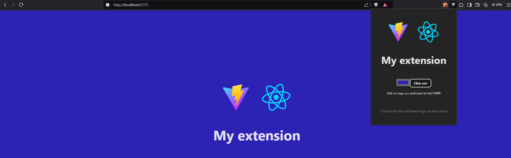

# chrome-extension-vite-typescript



<video width="640" height="400" controls>
  <source src="./vite-extension-demo.mp4" type="video/mp4">
</video>

## Concepts

### Script Contexts

Popup Context: Javascript that run in the context of that popup.

document.body.style.background = 'red' -> changes background of the popup

Service Worker context: Javascript context that sits outside the page you are visiting. Lets intercept network events and respond according with events. 
Background process, run detached from the UI. Is a second environment not only to extensions, but to pages.

Page Context (content scripts): Javascript that run in the context of that page itself

document.body.style.background = 'red' -> changes background of the page

### Code

Tells schema of manifest file

https://developer.chrome.com/docs/extensions/reference/manifest?hl=pt-br


```shell
npm create vite@latest
npm install
npm install -D @types/chrome
```

Everything on public will be copied to dist. Create manifest.json. 


```shell
npm run build
```

Load on chrome extensions the dist folder.


## References

https://youtu.be/GGi7Brsf7js